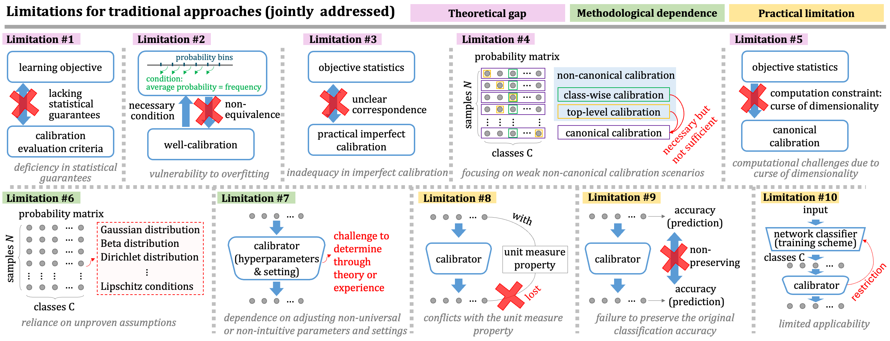

This is the official implementation of [H-Calibration](https://arxiv.org/abs/2506.17968), calibrating classification probabilities via theoretical equivalent error-bounded objective. It shows using H-Calibration objective (defined in `loss/hCalib.py`) to train post-hoc calibrators.



---
## Requirements

Set up the virtual environment and install dependencies:

```bash
conda create -n hcalib python=3.8.3
conda activate hcalib
pip install -r requirements.txt
```

> **Note:** The versions listed in `requirements.txt` have been tested compatible. Other versions may also work.

> **Additional SKCE Evaluation Dependency**: The [source evaluation code](https://github.com/devmotion/pycalibration) for metric `SKCE` relies on an external Julia package. It requires installing Julia and pyjulia. [Here](#install-julia-dependency-for-skce) is an installation guide.
> 
> Our original code uses the above Julia-based package. For convenience, here we also provide a pure Python reimplementation (`utils/skce.py`) of the original Julia-based package.  Our tests confirm that it produces results consistent with the original Julia version, with very slight negligible numerical deviations.
> 
> *If you'd prefer not to install external Julia, you can use our Python version by replacing the `_SKCE` class definition in `utils/utils.py` with the same class defined in `utils/skce.py`.*

---
## Data and Codebase Structure

Calibration is performed for various pretrained models (Download the data [here](https://huggingface.co/datasets/WJHuang/calibration/tree/main) from Hugging Face Dataset or [here](https://drive.google.com/file/d/1YuiXO2H-_gukF93yI_V0n_3VnkZa_JTd/view?usp=sharing) from Google Drive, then extract the file and move all '.p' files into current `data` folder.). Each '.p' file corresponds to a calibration task and includes both training and test splits, with associated logits and labels. For detailed descriptions of the datasets, please refer to our paper. 

The following is the file explanation of the project.


```plaintext
project/
│
├── data/                     # datasets: logits and labels (train/test)
│
├── loss/                     # loss for post-hoc calibration
│
├── utils/
│   ├── utils.py              # miscellaneous utility functions (e.g., evaluation, logging)
│   ├── builder.py            # builds dataloaders, loss functions, and evaluators, etc.
│   ├── eval_fast_worker.py   # for parallel evaluation used by evaluate_fast.py
│   └── skce.py               # python implementation of SKCE calibrator
│
├── expdir_full/              # full set of experiments for all candidate calibration mappings
│   ├── CIFAR10/              
│   │   ├── DenseNet40/
│   │   │  ├── LinearMap_tempnum_16/
│   │   │  │   └──config.json # configuration file for a single experiment
│   │   │  └── ...
│   │   └── ...
│   └── ...
│
├── expdir_final/             # final reported experiment for automatically selected mappings
│   │                         # (selected from full experiments via training performance)
│   ├── CIFAR10/              
│   │   ├── DenseNet40/
│   │   │  ├── TopCalEval/
│   │   │  │   └──config.json # configuration for top-label calibration
│   │   │  ├── NonTopCalEval/
│   │   │  │   └──config.json # configuration for non-top-label calibration
│   │   │  └── ...
│   │   └── ...
│   └── ...
│
├── models/                   # calibration mapping classes
│
├── comparison/               # reproduction of prior methods
│
├── calibrate.py              # training calibrator
│
├── evaluate.py               # evaluating calibrator
│
├── evaluate_fast.py          # fast parallel evaluation of multiple calibrators
│
├── Demo.py                   # a demo for training and evaluating calibrator
│
├── cli/
│   └── run.sh                # script running all reported experiments
│
├── README.md                 # project description
└── requirements.txt          # python dependencies
```

> **Note**: H-Calibrator was evaluated using a wide range of established metrics (up to 19 metrics, [see our paper](https://arxiv.org/abs/2506.17968)). Original implementations of many metrics are computationally expensive. For efficiency, I optimized calculation speed for some metrics while ensuring consistency with the original computation methods. Details on the source of each metric and our improved implementation can be found in the comments within `utils/utils.py`.

> **Note**: For calibration mapping, the [monotonic nonlinear network](https://github.com/AWehenkel/UMNN) is adopted as one of the learnable mapping following [previous study](https://github.com/AmirooR/IntraOrderPreservingCalibration). Similar to the optimizations made for evaluation metrics, I simplified and improved the efficiency of the original implementation for monotonic nonlinear network. See the comments in the corresponding files under `models/` for details.

> **Note**: `evaluate_fast.py` and `evaluate.py` produce the same results. It is recommended to use `evaluate_fast.py` for parallel evaluation of multiple calibrators, otherwise `evaluate.py` for evaluating a few calibrators.

> **Note**: The `comparison` folder currently contains reproduction results. Due to space limitations, we report only the evaluation performance of the compared methods. The calibrated logits are not included here but can be downloaded from Zenodo [here](https://zenodo.org/records/15868157) if readers are interested. As organizing all reproduced code for all compared existing methods takes some time, I may update the code later when I am available.

---
## Training & Evaluating Post-hoc Calibrators

Here is an example for training a calibrator with `config.json` file. The `--exp_dir` argument specifies the path to the experiment directory containing the config.json configuration file. The `--cuda_devices` specifies the gpu ids.


```bash
python calibrate.py --exp_dir expdir_final/CIFAR10/WideResNet32/TopCalEval --cuda_devices 0,1,2,3 --calibration_type TopCalEval
```
This performs top-label calibration.


```bash
python calibrate.py --exp_dir expdir_final/CIFAR10/WideResNet32/NonTopCalEval --cuda_devices 0,1,2,3 --calibration_type NonTopCalEval
```
This performs non top-label calibration.


To evaluate a trained calibrator, use the following commands:

```bash
python evaluate.py --exp_dir expdir_final/CIFAR10/WideResNet32/TopCalEval --batch_size 200 --calibration_type TopCalEval
```
for top-label calibration evaluation. Or 

```bash
python evaluate.py --exp_dir expdir_final/CIFAR10/WideResNet32/NonTopCalEval --batch_size 200 --calibration_type NonTopCalEval
```
for non top-label calibration evaluation.

See `demo.py` and `cli/run.sh` for other similar usage example.

> **Note**: specifying `batch_size`, for saving gpu memory, in `evaluate.py` will not change the results as the calibration evaluation is performed dataset-level not batch-level. However, changing this parameter in `calibrate.py` can lead to difference as the learning loss is optimized batch-level.

> **Note**: the only difference between the different `calibration_type` (TopCalEval vs. NonTopCalEval) is the model selector used. TopCalEval uses `dECE` by default, while NonTopCalEval uses `CWECE_a` by default, as explained in our paper.
---
## Our Training and Evaluation Logs

This is the organized cleaned version of the codebase released for reproducibility. Along with it, I provide the original training and evaluation log files as well as the learned calibrator weights used in the paper [here](https://drive.google.com/file/d/1oFoG5zWm1zEdiSNMfHw0SGko0tTME19q/view?usp=sharing) for reference. I also re-ran the experiments using this cleaned release. The logs from the re-run can be found [here](https://drive.google.com/file/d/1uHuSnsa2IRQHvQzzPKZnucCm_XH90kag/view?usp=sharing). I compared the results of two repeated runs and found them to be highly consistent. Our method maintains its ranking in terms of both mean absolute error and relative error across all metrics (consistently demonstrating state-of-the-art performance).

> **Note**: Some variable names in the original logs may differ from those in the re-run logs due to code standardization. Refer to the comments in `utils/builder.py` for correspondence details if your cares.

---
## Extras

### Install Julia Dependency for SKCE

The full Julia installation and integration process is as follows:

#### 1. Install Julia

Download the appropriate version of Julia from the [official Julia website](https://julialang.org/downloads/), and extract it, e.g,

```bash
tar zxvf julia-1.6.7-linux-x86_64.tar.gz
```

> You may also try the one-click installer on the website, although it has not been tested by me.

Add Julia to your system PATH:

```bash
vim ~/.bashrc
# Add the following line:
export PATH="$PATH:/path/to/<Julia directory>/bin"
```

Then source the file:

```bash
source ~/.bashrc
```


#### 2. Install PyJulia

Activate Python virtual environment and install:

```bash
source activate hcalib
python3 -m pip install --user julia
```


#### 3. Install Required Julia Packages

Enter the Julia environment:

```bash
julia
```

Then run the following commands:

```julia
using Pkg
Pkg.add("PyCall")
exit()
```


#### 4. Install PyCalibration Package


```bash
python -m pip install git+https://github.com/devmotion/pycalibration.git
```


#### 5. Link Python to Julia via PyJulia

Enter the Python environment:

```bash
python
```

Then execute:

```python
import julia
julia.install()
```


#### 6. Finalize PyCalibration Installation

Still in Python, complete the installation:

```python
from julia.api import Julia
jl = Julia(compiled_modules=False)
import pycalibration
pycalibration.install()
```


#### 7. Testing SKCE

Below is an example to test SKCE:

```python
from julia.api import Julia
jl = Julia(compiled_modules=False)

import julia
from pycalibration import ca

skce = ca.SKCE(ca.tensor(ca.ExponentialKernel(), ca.WhiteKernel()))

import numpy as np
rng = np.random.default_rng(1234)
predictions = [rng.dirichlet((3, 2, 5)) for _ in range(100)]
outcomes = rng.integers(low=1, high=4, size=100)

skce(predictions, outcomes)
```

---
## Citation

If you use this code repository in your research, teaching, or other activities, please cite the following paper:

```
Huang W, Cao G, Xia J, Chen J, Wang H, Zhang J. h-calibration: Rethinking Classifier
Recalibration with Probabilistic Error-Bounded Objective[J]. IEEE Trans. Pattern Anal.
Mach. Intell. (TPAMI), 2025.
```
